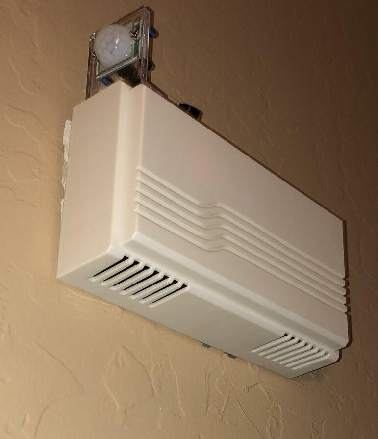
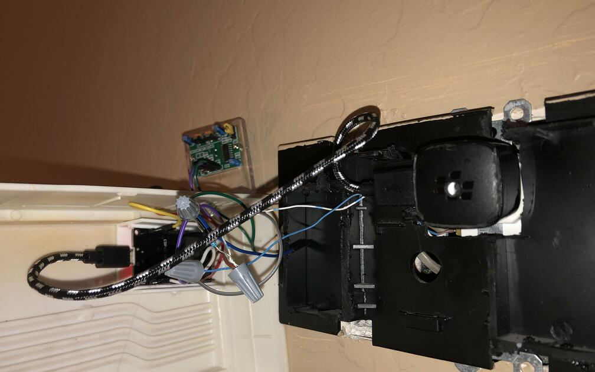
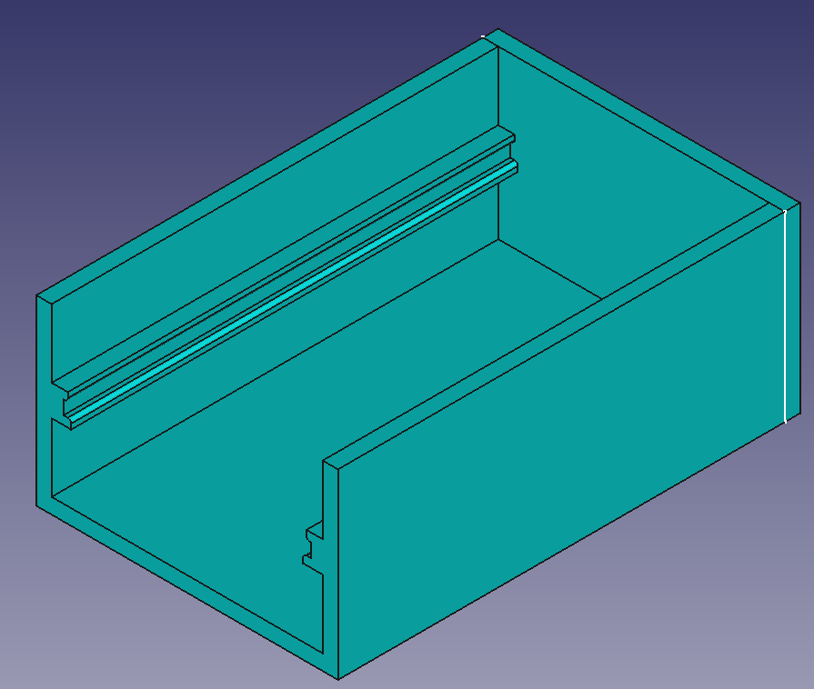
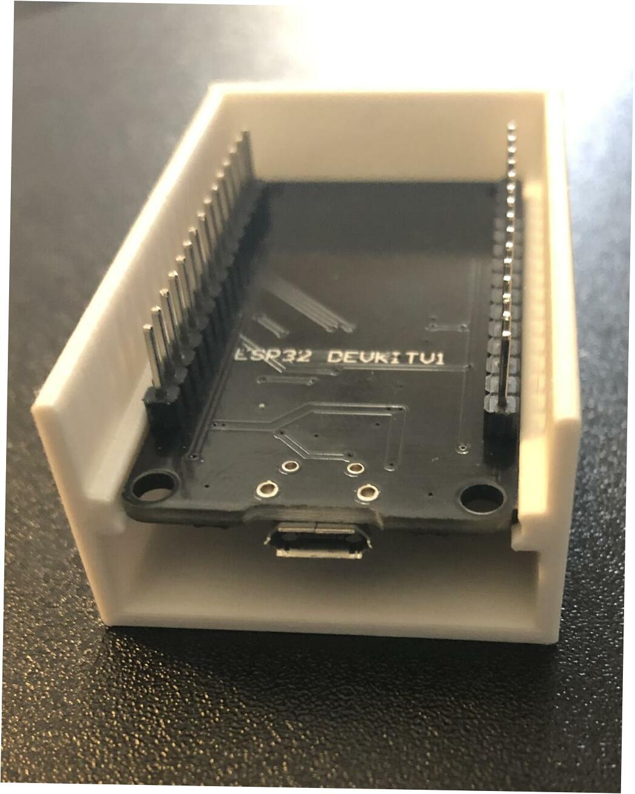
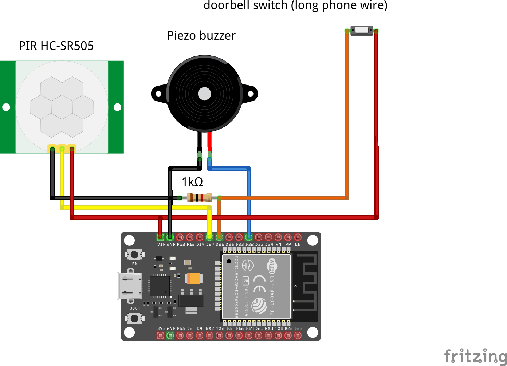
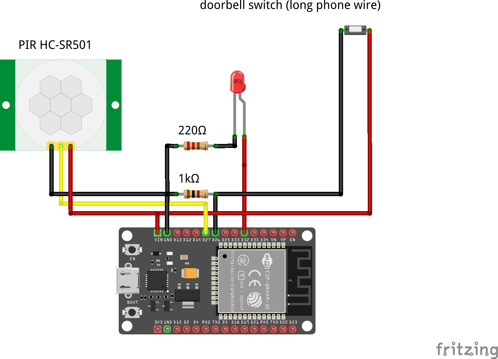

# ESP32 doorbell

## Description

DIY smart doorbell.

My doorbell chime stopped working.  I gutted the box with a dremel tool and a cutoff wheel.  I removed the transformer from the wall and replaced it with a standard receptable.  The small USB adapter has the port on the side, allowing the existing doorbell cover to fit over all of the parts.



- Drop-in replacement for existing doorbell
- NTP is used to set time and allow for Do-not-Disturb hours
- In addition to playing a sound when the doorbell button is pressed, an MQTT message is published
- A PIR motion sensor also sends MQTT messages
- Node-RED subscribes to the MQTT topic and sends a message using Slack when the doorbell button is pressed
- Node-RED publishes Prometheus metrics so events can be graphed in Grafana

## Parts

- [ESP32 devkit - 30 pin, integrated antenna](https://www.aliexpress.com/item/1005001267643044.html)
- [passive piezo buzzer](https://www.aliexpress.com/item/4001317667682.html) or anything to make noise
- [HC-SR501 Infrared PIR Motion Sensor](https://www.aliexpress.com/item/32731348914.html)

## Code

As my first major rewrite of my doorbell, I originally changed everything to attach interrupts to the digital input pins for the doorbell button and motion sensor.  Unfortunately, this was not reliable and caused too many false alarms.  I'm pretty sure the long telephone wire that runs from the doorbell to the door was picking up elecrical noise and acting like a large antenna.  I may eventually purchase some octocouplers and try this out again.  The working code is back to a more traditional setup of polling and reading the digital inputs.  Going with interrupts would also allow deep sleep to be used.

## Assembly

The inside is a bit ugly.  I was considering 3D printing a 2-gang electrical box cover to hold everything, but I'd have some paint to touch up and I just started learning FreeCAD and wanted to start small.



The FreeCAD and STL files are in the *case* folder.  The rails perfectly fit the 30-pin ESP32 w/ integrated antenna and the 38-pin ESP32 w/ external antenna.  This was my first test-print, but it helped with the assembly to quickly hot-glue the ESP32 holder to the inside of the old doorbell case.





## Diagram



When developing this, I swapped the buzzer out for an LED with the same code.



## Node-RED


[JSON for above flow](node-red/flow.json)

The beginning of the flow starts out with Node-RED listening on the MQTT topic for messages.  The messages get converted from JSON to payload objects.  Whenever a MQTT message is received, a timestamp is recorded in the func-doorbell-events node.

The "inject healthcheck" node periodically sends a message that is compared to the last MQTT timestamp.  If no MQTT messages have been recieved for a while, the flow is marked offline and a new message is returned to zero out the Prometheus metrics at the end of the flow.

The "inject timeout" handles resetting the motion and doorbell Prometheus metrics back to zero after an alert, but ensures the value stays at "1" long enough for Prometheus to scrape the exporter.

The prometheus data shown below at \<node_red_url\>:1880/metrics.

```
# HELP doorbell_signal doorbell signal
# TYPE doorbell_signal gauge
doorbell_signal -59

# HELP doorbell_ring doorbell ring
# TYPE doorbell_ring gauge
doorbell_ring 0

# HELP doorbell_motion doorbell motion
# TYPE doorbell_motion gauge
doorbell_motion 0
```

The func-doorbell-ring node also sends a message to Slack.

Below is an example graph in Grafana.


